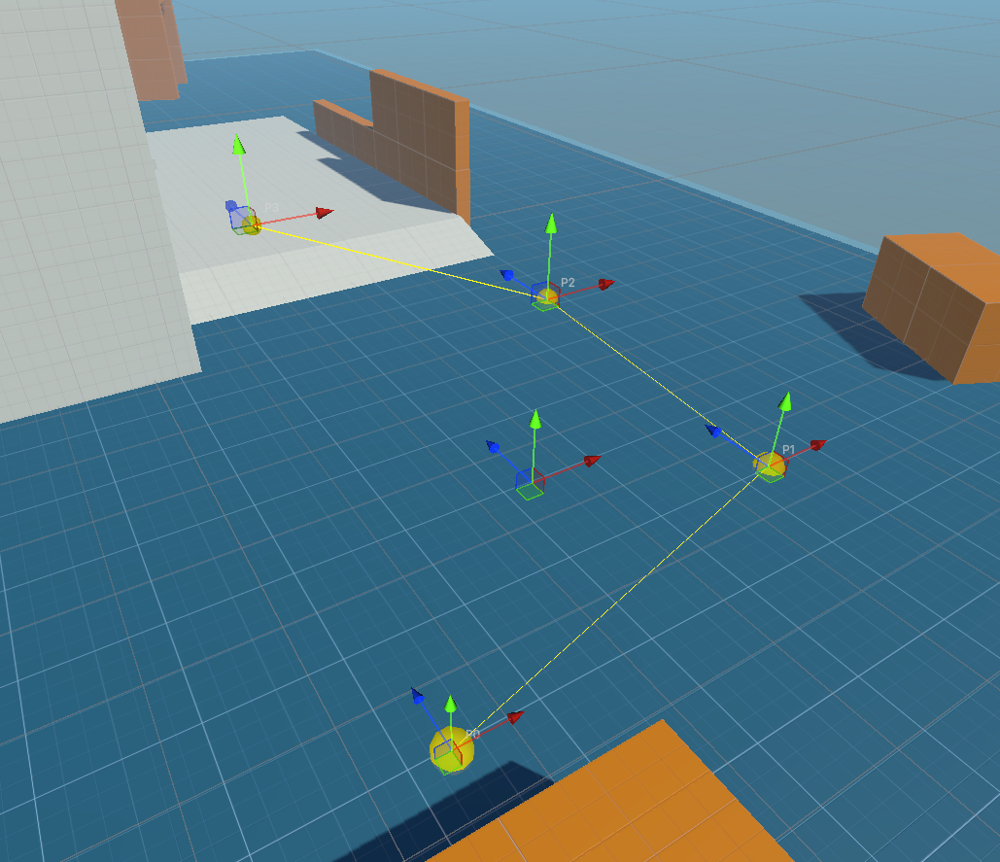

# Unity-Waypoints  

This package contains easy to use tools designed for quick in-editor management of waypoints and travel.  
(Travel has not been added yet).

## Installation
You can install this package via the Package Manager.  
Simply use the Plus icon in the top left and select "Install package from GIT url..." and enter `https://github.com/DumbTrollface/Unity-Waypoints.git`.  
Optionally you can specify a version by appending the tag or branch with `#`. Example `https://github.com/DumbTrollface/Unity-Waypoints.git#v1.0.1`.
